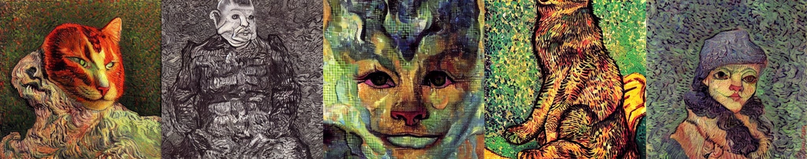

# Steganography

This repository contains code and experiments developed for a master’s thesis focused on **steganography** and its application to generative image models.

## Thesis

**Title:** Steganographic Watermarks in Training Data: Impacts on Generative Image Models and Data Integrity

This work investigates how steganographic techniques and watermarks can be embedded into images used for training generative models, and how such hidden signals affect model behavior. The goal is to analyze the propagation of hidden information into trained models and explore implications for model integrity, watermarking, and data provenance.

The most important finding of this thesis is that the adversarial perturbation method can produce a watermark that is almost imperceptible to the human eye while remaining sufficiently effective to significantly disrupt the behaviour of the fine-tuned diffusion model.

This method allows a watermark to be embedded into training images while remaining almost invisible to the human eye.

  

The watermark was then used to poison the training dataset, causing a significant deterioration in the generated images. The model changed from:

  

to:

  

